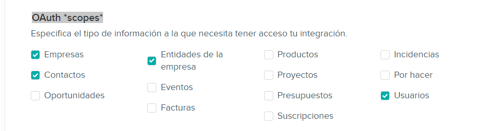

# Video proceso integración teamleader centralita
Es necesario generar un código de enlace con teamleader desde la gestión de API de teamleader
Puede ver el siguiente video para visualizar los paso a seguir:
[REGISTRO API PARA TEAMLEADER - YouTube](https://www.youtube.com/watch?v=NtNTKFzflws)


# PASOS A SEGUIR
## Gestión de la integración en teamleader
El link para crear el usuario y password de Api, gestiona tus integraciones activas de Teamleader Focus desde aquí.
[Marketplace Teamleader Focus](https://marketplace.focus.teamleader.eu/es/es/gestion)

### Datos a rellenar en la pantalla 
> [!warning]
> Rellene *Validar URIs de redirección (Redirect URIs)*
> exactamente con el siguiente codigo:
```Validar URIs de redirección (Redirect URIs)
http://127.0.0.1:5000/callback
```

>[!warning]
> Marque en OAuth *scopes*
> exactamente con el siguiente código:


Para Finalizar rellene con la descripción en ingles ( cualquier texto sirve)


>[!done] *ANOTE* la credenciales 
>Credenciales OAuth2
>*Client ID*
>*Client secret*
>


### Configuración Centralita 
Copie de ventana de integración de teamleader
> [!alert] datos generados por TEAMLEADER
> - *Client ID*
> -  *Client secret*
