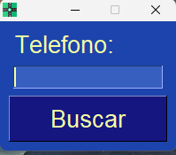
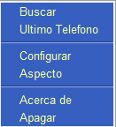

# Introducción: 
La integración la aplicación CRM-Teamleader  le aporta mayores beneficios en sus comunicaciones porque le permite mejorar la gestión de tiempo y de los recursos. Esta integración de la centralita destaca por la marcación de un *solo clic al lanzar las llamadas*, _registro automático_ con la información detallada de las llamadas  y mucho más, que garantiza que tenga todos los datos de los clientes a mano y sea más efectiva las comunicaciones. Apertura automática de la ficha de Teamleader con contenga el numero entrante o saliente. 

Consulta de la base de datos de empresa y relleno de datos comerciales de forma rápida y sencilla [^1].

[^1] solo datos empresas españolas
### Requisitos del sistema:
#### Sistema Windows compatible:
- Windows 10 o superior con Espacio mínimo 5 Mb
#### Enlace Movil Android (opcional)
- Llamadas entrantes y saliente automáticas
- App Android instalada y conectada [App-Call-remoto](App-Call-remoto.md)

### Usuario Clave Api
- Obtener credenciales [Api-Teamleader](api-teamleader.md)
    
### Instalación Centralita 
 [Pasos para instalación Centralita Teamleader](link-descarga-software-centralita-teamleader.md)
### Interfaz de usuario
- Si el proceso se realiza correctamente en la parte Derecha aparece el siguiente Icono.

#### Botón Izquierdo sobre el icono.
- Pulsado sobre icono con botón del ratón Izquierdo 

- Si el teléfono no se encuentra se abrir de forma automática la pantalla:
 

[Documentacion para creacion nuevos Registros en Teamleader](creacion-nuevo-registros-teamleader.md)

#### Botón derecho sobre icono

##### Buscar
Mismo resultado que pantalla anterior pulsando botón Izquierdo

##### Ultimo Teléfono
Usa el ultimo teléfono introducido manualmente capturado con la aplicación [App-Call-remoto](App-Call-remoto.md)

##### Configuración Centralita
[Menu Pantalla configuracion centralita teamleader](pantalla-configuracion-centralita-teamleader.md).

Parámetro de uso de la Herramienta:

- Idiomas disponibles 
- Registro  [API activa en Teamleader](api-teamleader.md)
- Auto cierre Alta registro por falta de actividad
- Uso de APP enlace Móvil Android automatización llamadas. [App-Call-remoto](App-Call-remoto.md)

##### Aspecto.

Cambie los colores de la  centralita. Dispone de casi 50 opciones para ello.

#### Integraciones terminales android
De forma automática la llamada entrantes o salientes verifica en CRM-Teamleader el registro.
Uso de la aplicación de terceros [App-Call-remoto](App-Call-remoto.md)
    
### Solución de problemas
En la siguiente WEB
	[Soporte Nivel2](https://alca.co/)
    
### Conclusiones
Con una pequeña inversión tendrá una funcionalidad que aumentar su productividad  para crear y localizar contacto de forma automática y crear con todo los datos posibles usando IA.

>[!done]Ventajas
> - No necesita cambiar de operador telefonico
> - Mecaniza la entrada y localizacion de fichas que contega el numero de telefono.

>[!Alert]Desventajas
>- Solo compatible con Android [App-Call-remoto](App-Call-remoto.md)
